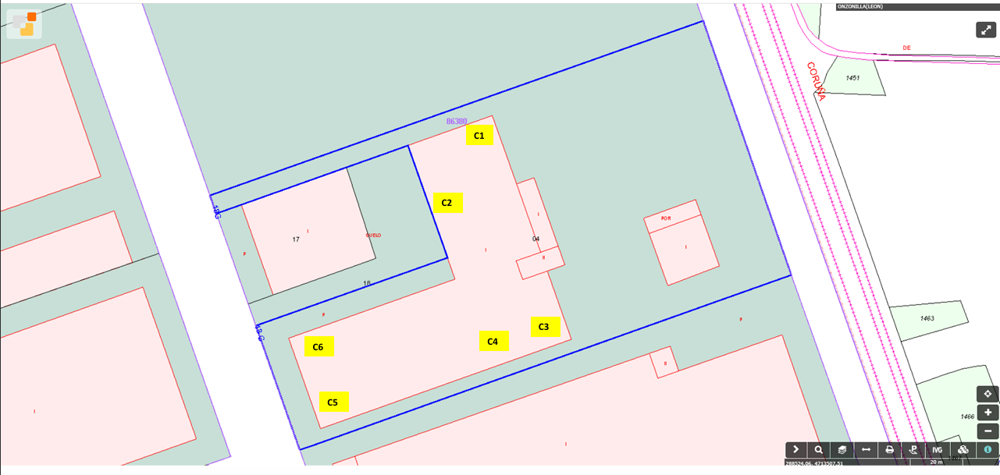

# Calculo y diseno de una instalacion de GLP

## Objeto

Definir una instalacion de almacenamiento con deposito y una red de distribucion hasta cada consumidor, utilizando GLP como combustible y justificando la solucion desde el punto de vista tecnico y de seguridad.

## Datos de partida

- Los datos necesarios para cada grupo se indican en `00_Info_proporcionada/DATOS GRUPOS-2026.xlsx`.
- La ubicacion y naturaleza de los consumidores se toma de `Proyecto/Datos.md` y de la documentacion proporcionada.
- Las mediciones y distancias se verificaran sobre la referencia catastral y el plano base `01_Planos/instalacion_GLP.dwg`.

## Calculos y comprobaciones requeridas

- Caudal individual y total de calculo.
- Autonomia de almacenamiento para 30 dias.
- Vaporizacion natural del deposito o conjunto de depositos.
- Calculo del volumen del deposito y de sus caracteristicas principales.
- Calculo de la conduccion de distribucion, incluyendo diametros, presiones y perdidas de carga.
- Esquema de distribucion, estacion de almacenamiento y comprobacion de distancias de seguridad.
- Eleccion de la ubicacion de la estacion de GLP con justificacion tecnica y reglamentaria.

## Salida documental

- La salida tecnica primaria se desarrolla en `Proyecto/Especificaciones/`.
- La metodologia y trazabilidad se gobiernan desde `Proyecto/Planificacion/`.
- La consolidacion editorial posterior se realizara en `Practica_GLPs_LaTeX/`.

