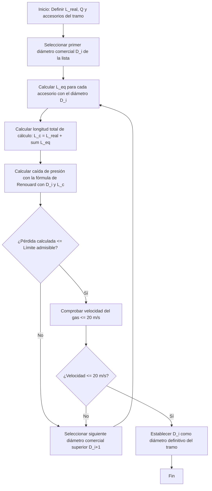

# Metodología para el Cálculo de la Longitud de Cálculo y Dimensionado de Tuberías (GLP)

Este documento describe las bases técnicas y los métodos matemáticos para calcular la **longitud de cálculo ($L_c$)** y dimensionar los diámetros de tuberías de la red de distribución de gas licuado del petróleo (GLP) para el Grupo G1-1. Las ecuaciones y parámetros de partida están en concordancia con el documento general de referencia [[formulario.md](file:///H:/Unidades%20compartidas/Practicas_Inst2/4_GLPs/.agents/skills/doc_tecnica_glp/references/formulario.md)].

---

## 1. Ecuaciones Base y Parámetros

El dimensionado de los diámetros interiores se realiza mediante las **fórmulas de Renouard (UNE 60 621-96)**, aplicables siempre que la relación entre el caudal y el diámetro interior cumpla con la siguiente condición de flujo:

$$ \frac{Q}{D} < 150 $$

### 1.1. Ecuación de Renouard para Media Presión (MP)
Aplicable en conducciones con presiones de operación de $0.05\text{ bar} < P < 5\text{ bar}$:

$$ P_A^2 - P_B^2 = 51.5 \cdot d_c \cdot L_c \cdot \frac{Q^{1.82}}{D^{4.82}} $$

### 1.2. Ecuación de Renouard para Baja Presión (BP)
Aplicable en conducciones con presiones de operación de $P < 0.05\text{ bar}$ (instalaciones receptoras individuales):

$$ P_A - P_B = 25076 \cdot d_c \cdot L_c \cdot \frac{Q^{1.82}}{D^{4.82}} $$

### 1.3. Nomenclatura y Unidades del Sistema
*   $P_A, P_B$: Presiones absolutas (origen y final de la conducción) en $\text{bar a}$ para MP (Relativa + $1.01325\text{ bar}$), o presiones relativas en $\text{mbar}$ para BP.
*   $d_c$: Densidad corregida del gas (para Propano $d_c = 1.16$; para Butano $d_c = 1.44$).
*   $L_c$: Longitud de cálculo de la conducción en metros ($\text{m}$).
*   $Q$: Caudal de gas en el tramo en metros cúbicos por hora a condiciones normales ($\text{m}^3/\text{h}$).
*   $D$: Diámetro interior de la tubería en milímetros ($\text{mm}$).

---

## 2. Método 1: Coeficientes de Mayoración Globales (Método Simplificado)

Es el procedimiento estándar adoptado en la fase de anteproyecto. En lugar de evaluar individualmente cada accesorio, las pérdidas singulares de carga se estiman de forma global aplicando un factor multiplicador sobre la longitud real o geométrica del tramo ($L$).

De acuerdo con los manuales de cálculo de GLP:
*   **En Baja Presión (BP):** Se estima que las pérdidas de carga en codos, llaves y derivaciones incrementan la pérdida lineal del tramo en un $20\%$:
    $$ L_c = 1.20 \times L $$
*   **En Media Presión (MP):** Se estima que los accesorios aportan un incremento del $5\%$ sobre la pérdida lineal del tramo:
    $$ L_c = 1.05 \times L $$

### Ventajas e Inconvenientes
*   **Pros:** Permite el dimensionamiento directo sin conocer a priori los accesorios definitivos ni el trazado exacto de las piezas de unión. No requiere iteración.
*   **Contras:** Puede resultar conservador en tramos de gran longitud o insuficiente en tramos muy cortos con una elevada densidad de válvulas y codos.

---

## 3. Método 2: Longitudes Equivalentes por Accesorio (Método Iterativo)

Este método calcula la longitud de cálculo ($L_c$) mediante la suma de la longitud geométrica real del tubo ($L_{real}$) y la longitud equivalente de fricción ($L_{eq}$) correspondiente a cada accesorio instalado en ese tramo de red.

$$ L_c(D) = L_{real} + \sum L_{eq}(D) $$

Dado que la caída de presión en una singularidad depende del tamaño físico del tubo, las longitudes equivalentes de los accesorios se definen de manera proporcional al **diámetro interior ($D$)** de la tubería.

### 3.1. Factores Adimensionales de Longitud Equivalente ($L_{eq}/D$)
A continuación, se tabulan los coeficientes típicos de pérdidas para accesorios de gas (derivados de los coeficientes de fricción y ensayos recogidos en manuales de ingeniería de fluidos como el *Crane Co. TP 410*):

| Tipo de Accesorio | Equivalencia en Diámetros ($L_{eq}/D$) |
| :--- | :---: |
| **Codo de 90º de radio estándar** | $30$ |
| **Codo de 45º** | $15$ |
| **Te (flujo en línea recta)** | $20$ |
| **Te (flujo a 90º / ramal desviado)** | $60$ |
| **Válvula de corte de bola (paso total)** | $10$ |
| **Reducciones de diámetro** | $10$ |

*Nota: Para obtener $L_{eq}$ en metros, se multiplica el coeficiente de la tabla por el diámetro interior de la tubería expresado en **metros** (es decir, $D_{\text{mm}} / 1000$).*

### 3.2. Algoritmo de Cálculo Iterativo paso a paso

Como la longitud equivalente depende de $D$, y $D$ es el valor a calcular, la ecuación no puede despejarse de forma analítica directa. El algoritmo se implementa mediante los siguientes pasos:



1.  **Paso 1:** Identificar los accesorios reales del tramo a dimensionar (ej. 3 codos de 90º y 1 válvula).
2.  **Paso 2:** Seleccionar un diámetro comercial de inicio $D$ (ej. Cobre $\varnothing 15\text{ mm}$ exterior, $D = 13\text{ mm}$ interior).
3.  **Paso 3:** Calcular la longitud de cálculo en metros:
    $$ L_c = L_{real} + \sum \left( \text{Coeficiente} \times \frac{D}{1000} \right) $$
4.  **Paso 4:** Calcular la pérdida de carga teórica aplicando la ecuación de Renouard correspondiente (Baja o Media Presión).
5.  **Paso 5:** Comparar el resultado con la pérdida de carga admisible del tramo:
    *   **Si $\Delta P_{\text{calculada}} > \Delta P_{\text{admisible}}$:** El diámetro es insuficiente. Seleccionar el siguiente diámetro comercial superior de la lista y volver al **Paso 3**.
    *   **Si $\Delta P_{\text{calculada}} \leq \Delta P_{\text{admisible}}$:** Comprobar la velocidad del gas mediante la ecuación de velocidad límite:
        $$ v = 378.04 \times \frac{Q}{P \times D^2} \le 20\text{ m/s} $$
        Si la velocidad es conforme, este es el diámetro comercial óptimo para el tramo.

---

## 4. Ejemplo Práctico de Script en Python para Automatizar el Cálculo

A continuación se muestra un código en Python que implementa esta metodología iterativa de manera automatizada para un tramo de tubería:

```python
import numpy as np

# Datos de entrada
L_real = 4.97  # metros
Q = 25.5       # m3/h
P_inicial = 1.45  # bar relativos (MP-A)
P_inicial_abs = P_inicial + 1.01325  # bar absolutos
d_c = 1.16     # propano
DP_admisible = 0.05  # bar de caída máxima admisible en el tramo

# Catálogo de tuberías comerciales (diámetro exterior x espesor -> diámetro interior en mm)
tuberias_cobre = [
    {"nom": "15x1", "D_int": 13.0},
    {"nom": "18x1", "D_int": 16.0},
    {"nom": "22x1", "D_int": 20.0},
    {"nom": "28x1", "D_int": 26.0},
    {"nom": "35x1.5", "D_int": 32.0},
    {"nom": "42x1.5", "D_int": 39.0}
]

# Accesorios en el tramo
accesorios = {
    "codo_90": {"cant": 2, "coef": 30},
    "valvula_bola": {"cant": 1, "coef": 10}
}

print(f"Buscando diámetro comercial óptimo para L_real = {L_real} m y Q = {Q} m3/h...")

for tub in tuberias_cobre:
    D = tub["D_int"]  # mm
    D_m = D / 1000.0  # m
    
    # Calcular sumatoria de longitudes equivalentes
    sum_Leq = 0.0
    for acc, datos in accesorios.items():
        sum_Leq += datos["cant"] * (datos["coef"] * D_m)
        
    L_c = L_real + sum_Leq
    
    # Ecuación de Renouard para Media Presión:
    # PA^2 - PB^2 = 51.5 * dc * Lc * (Q^1.82 / D^4.82)
    PA2_PB2 = 51.5 * d_c * L_c * (Q**1.82) / (D**4.82)
    
    # Presión final absoluta
    PB_abs = np.sqrt(P_inicial_abs**2 - PA2_PB2)
    # Caída de presión en bar
    DP_calc = P_inicial_abs - PB_abs
    
    # Velocidad del gas (m/s)
    v = 378.04 * Q / (PB_abs * (D**2))
    
    print(f"Tubo {tub['nom']} (D_int={D}mm) -> L_c={L_c:.2f}m, DP={DP_calc:.4f} bar, v={v:.2f} m/s")
    
    if DP_calc <= DP_admisible and v <= 20.0:
        print(f"--> SELECCIONADO: Tubo {tub['nom']} (D_int={D} mm) cumple los requisitos.")
        break
else:
    print("Ninguna tubería del catálogo cumple las condiciones impuestas.")
```
