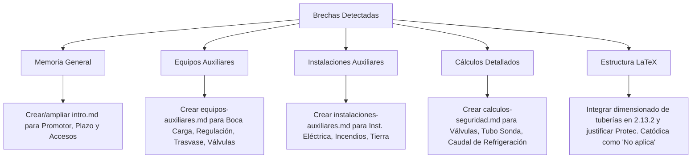

# Inventario Documental y Estructura Canónica (Fases 1 y 2)

Este documento recoge los resultados de la ejecución de la **Fase 1 (Inventario documental)** y la **Fase 2 (Extracción de estructura canónica y análisis de brechas)** según lo establecido en el plan de implementación ([plan_implementacion_especificaciones_documentacion.md](file:///H:/Unidades%20compartidas/Practicas_Inst2/4_GLPs/Proyecto/Planificacion/plan_implementacion_especificaciones_documentacion.md)).

---

## 1. Fase 1: Inventario Documental Verificable

Se ha realizado una auditoría exhaustiva del espacio de trabajo `H:\Unidades compartidas\Practicas_Inst2\4_GLPs\` para identificar y caracterizar todos los archivos asociados al desarrollo del proyecto.

### 1.1. Inventario de Especificaciones (`Proyecto/Especificaciones/`)
Estos archivos representan la capa de desarrollo documental intermedio en formato Markdown.

| Nombre de Archivo | Tamaño (Bytes) | Propósito y Contenido Principal | Apartado LaTeX Asociado |
| :--- | :---: | :--- | :--- |
| [intro.md](file:///H:/Unidades%20compartidas/Practicas_Inst2/4_GLPs/Proyecto/Especificaciones/intro.md) | 916 B | Contextualización del proyecto del grupo `G1-1`, descripción de objetivos generales y alcance documental primario. | `OBJETO.`, `ANTECEDENTES.` |
| [datos-partida.md](file:///H:/Unidades%20compartidas/Practicas_Inst2/4_GLPs/Proyecto/Especificaciones/datos-partida.md) | 9.18 KB | Consolidación de hipótesis de cálculo, datos geográficos (León), temperatura de cálculo ($-5 \text{ ºC}$), datos de consumidores, y parámetros físicos del propano. | `IDENTIFICACIÓN.`, `EMPLAZAMIENTO DE LAS INSTALACIONES.`, `CARACTERÍSTICAS DEL GAS SUMINISTRADO.` |
| [demanda-consumo.md](file:///H:/Unidades%20compartidas/Practicas_Inst2/4_GLPs/Proyecto/Especificaciones/demanda-consumo.md) | 4.67 KB | Cálculo de caudales de cálculo (másicos y volumétricos) de los consumidores C1 a C6 y demanda térmica total ($2.620 \text{ kW}$). | `RESUMEN DE CARACTERÍSTICAS.` (Caudal), `CONSUMO Y AUTONOMÍA.` |
| [autonomia.md](file:///H:/Unidades%20compartidas/Practicas_Inst2/4_GLPs/Proyecto/Especificaciones/autonomia.md) | 438 B | Justificación de la capacidad de almacenamiento necesaria para cubrir 30 días de funcionamiento continuado. | `RESUMEN DE CARACTERÍSTICAS.` (Volumen), `CONSUMO Y AUTONOMÍA.` |
| [deposito.md](file:///H:/Unidades%20compartidas/Practicas_Inst2/4_GLPs/Proyecto/Especificaciones/deposito.md) | 444 B | Selección y justificación de la configuración del almacenamiento (batería de depósitos aéreos) basada en la autonomía. | `RESUMEN DE CARACTERÍSTICAS.` (Tipo y Volumen), `CARACTERÍSTICAS DE LOS EQUIPOS.` -> `Depósitos.` |
| [vaporizacion.md](file:///H:/Unidades%20compartidas/Practicas_Inst2/4_GLPs/Proyecto/Especificaciones/vaporizacion.md) | 514 B | Comprobación de la capacidad de vaporización natural del depósito en las condiciones de León y balance técnico para el apoyo forzado. | `CARACTERÍSTICAS DE LOS EQUIPOS.` -> `Equipo de vaporización.`, `VAPORIZACIÓN.` |
| [red-distribucion.md](file:///H:/Unidades%20compartidas/Practicas_Inst2/4_GLPs/Proyecto/Especificaciones/red-distribucion.md) | 635 B | Arquitectura de la red aérea, descripción de materiales (cobre UNE-EN 1057) y especificación de trazados primarios. | `DESCRIPCIÓN Y SISTEMA ELEGIDO.`, `CARACTERÍSTICAS DE LOS EQUIPOS.` -> `Canalizaciones.` |
| [implantacion-seguridad.md](file:///H:/Unidades%20compartidas/Practicas_Inst2/4_GLPs/Proyecto/Especificaciones/implantacion-seguridad.md) | 365 B | Justificación de la ubicación física de la estación de almacenamiento y cumplimiento de la normativa UNE 60250 en la parcela. | `CLASIFICACIÓN Y DISTANCIAS DE SEGURIDAD.` |
| [conclusiones-limitaciones.md](file:///H:/Unidades%20compartidas/Practicas_Inst2/4_GLPs/Proyecto/Especificaciones/conclusiones-limitaciones.md) | 627 B | Resumen técnico del cierre del proyecto, simplificaciones académicas asumidas y límites operacionales de los cálculos. | Sin apartado directo (se integra transversalmente en la Memoria). |
| [anejos.md](file:///H:/Unidades%20compartidas/Practicas_Inst2/4_GLPs/Proyecto/Especificaciones/anejos.md) | 446 B | Estructura general de planos, tablas y resultados detallados que actúan como anejos en el documento final. | `ÍNDICE DE ANEXOS.`, `Planos` (Capítulo) |
| [metodologia.md](file:///H:/Unidades%20compartidas/Practicas_Inst2/4_GLPs/Proyecto/Especificaciones/metodologia.md) | 5.46 KB | Guía prescriptiva de contenidos obligatorios, criterios de validación y comprobaciones para cada sección de cálculo. | Apoyo transversal (no se vuelca a LaTeX de forma literal). |
| [metodologia-longitud-calculo.md](file:///H:/Unidades%20compartidas/Practicas_Inst2/4_GLPs/Proyecto/Especificaciones/metodologia-longitud-calculo.md) | 8.62 KB | Ecuaciones de Renouard, métodos de cálculo de longitud equivalente (simplificado e iterativo) y algoritmo en Python. | Sin apartado directo en `plantilla.tex` (brecha de la plantilla). |

### 1.2. Inventario de Evidencias y Notas Técnicas (`Proyecto/Anotaciones/`)
Estos archivos contienen los cálculos de ingeniería, resúmenes normativos y datos de catálogo que sirven de evidencia técnica.

| Nombre de Archivo | Tamaño (Bytes) | Contenido de Ingeniería / Datos Soportados |
| :--- | :---: | :--- |
| [autonomia_30_dias.md](file:///H:/Unidades%20compartidas/Practicas_Inst2/4_GLPs/Proyecto/Anotaciones/autonomia_30_dias.md) | 1.34 KB | Balance diario de propano. Cálculo de masa diaria necesaria ($1.264,52 \text{ kg/día}$) y volumen útil para 30 días. |
| [calculo_volumen_deposito.md](file:///H:/Unidades%20compartidas/Practicas_Inst2/4_GLPs/Proyecto/Anotaciones/calculo_volumen_deposito.md) | 1.87 KB | Desarrollo matemático para pasar de volumen útil a volumen geométrico ($93,64 \text{ m}^3$ mínimos) considerando factor de llenado del $85\%$. |
| [caudales_consumidores.md](file:///H:/Unidades%20compartidas/Practicas_Inst2/4_GLPs/Proyecto/Anotaciones/caudales_consumidores.md) | 1.17 KB | Cálculo individual de consumo másico ($Q_{kg/h}$) basado en $P_{nom}$ y $PCS$ ($13,95 \text{ kWh/kg}$) para los 6 consumidores del grupo G1-1. |
| [criterios_normativos.md](file:///H:/Unidades%20compartidas/Practicas_Inst2/4_GLPs/Proyecto/Anotaciones/criterios_normativos.md) | 746 B | Extracto y referencia de reglamentos clave (RD 919/2006, ITC-ICG 03, UNE 60250:2008, CTE DB-SI). |
| [dimensionado_tuberias_glp.md](file:///H:/Unidades%20compartidas/Practicas_Inst2/4_GLPs/Proyecto/Anotaciones/dimensionado_tuberias_glp.md) | 28.74 KB | Memoria de cálculo completa tramo a tramo, pérdidas de carga (Renouard MPB, presión inicial $1,7 \text{ bar}$) y comprobaciones de velocidad ($\le 10 \text{ m/s}$). |
| [distancias_seguridad.md](file:///H:/Unidades%20compartidas/Practicas_Inst2/4_GLPs/Proyecto/Anotaciones/distancias_seguridad.md) | 7.10 KB | Tabla de distancias de seguridad del recinto A-500, dimensiones de la batería de depósitos y justificación de protecciones contra incendios (extintores, rociadores). |
| [pliego_condiciones_equipos_glp.md](file:///H:/Unidades%20compartidas/Practicas_Inst2/4_GLPs/Proyecto/Anotaciones/pliego_condiciones_equipos_glp.md) | 5.50 KB | Especificaciones de calidad, pruebas e instalación para depósitos, reguladores, tuberías y elementos de control. |
| [potencia_armario_calefaccion.md](file:///H:/Unidades%20compartidas/Practicas_Inst2/4_GLPs/Proyecto/Anotaciones/potencia_armario_calefaccion.md) | 3.52 KB | Justificación térmica y dimensionamiento del equipo de vaporización forzada auxiliar (cálculo de potencia del armario de agua caliente). |
| [recopilacion_accesorios_costes_glp.md](file:///H:/Unidades%20compartidas/Practicas_Inst2/4_GLPs/Proyecto/Anotaciones/recopilacion_accesorios_costes_glp.md) | 7.96 KB | Catálogo de precios unitarios de tuberías de cobre, válvulas, depósitos, vaporizadores y mano de obra para el presupuesto. |
| [reporte_accesorios.md](file:///H:/Unidades%20compartidas/Practicas_Inst2/4_GLPs/Proyecto/Anotaciones/reporte_accesorios.md) | 3.55 KB | Conteo de codos, válvulas, tees y transiciones por tramo medidos desde el esquema de instalación base. |
| [seleccion_deposito.md](file:///H:/Unidades%20compartidas/Practicas_Inst2/4_GLPs/Proyecto/Anotaciones/seleccion_deposito.md) | 2.28 KB | Comparación de alternativas comerciales. Selección de 2 depósitos Lapesa de 46,6 m³ y 2 depósitos de 25,9 m³ para sumar 125,1 m³ totales. |
| [temperatura_diseno.md](file:///H:/Unidades%20compartidas/Practicas_Inst2/4_GLPs/Proyecto/Anotaciones/temperatura_diseno.md) | 1.14 KB | Justificación climatológica para León usando bases de datos del IDAE (percentil 99,6% de temperaturas mínimas). |
| [trazado_red.md](file:///H:/Unidades%20compartidas/Practicas_Inst2/4_GLPs/Proyecto/Anotaciones/trazado_red.md) | 1.41 KB | Descripción geométrica de los tramos de cobre y longitudes de tubería medidas sobre el plano base de parcela. |
| [valvuleria_accesorios.md](file:///H:/Unidades%20compartidas/Practicas_Inst2/4_GLPs/Proyecto/Anotaciones/valvuleria_accesorios.md) | 2.68 KB | Especificación técnica de válvulas de esfera, reguladores de primera y segunda etapa, y válvulas de seguridad de la estación de almacenamiento. |
| [vaporizacion_forzada.md](file:///H:/Unidades%20compartidas/Practicas_Inst2/4_GLPs/Proyecto/Anotaciones/vaporizacion_forzada.md) | 6.40 KB | Ecuaciones y cálculos térmicos detallados del armario de vaporización, caudal del evaporador y su dimensionamiento físico. |
| [vaporizacion_natural.md](file:///H:/Unidades%20compartidas/Practicas_Inst2/4_GLPs/Proyecto/Anotaciones/vaporizacion_natural.md) | 1.21 KB | Balance térmico de la batería. Capacidad máxima de gasificación natural a $-5 \text{ ºC}$ y $20\%$ de llenado ($85,89 \text{ kg/h}$), demostrando déficit frente a demanda ($187,81 \text{ kg/h}$). |

### 1.3. Reutilización de Artefactos de Planificación (`Proyecto/Planificacion/`)
Los siguientes archivos creados en etapas de planificación previas son recursos clave para gobernar las relaciones y coherencia del proyecto:

1.  **[matriz_fuentes.md](file:///H:/Unidades%20compartidas/Practicas_Inst2/4_GLPs/Proyecto/Planificacion/matriz_fuentes.md) (3.35 KB):** Establece el mapa de trazabilidad entre especificaciones Markdown y secciones LaTeX. Ayuda a controlar qué archivo Markdown alimenta técnicamente a cada apartado de la plantilla.
2.  **[esquema_memoria.md](file:///H:/Unidades%20compartidas/Practicas_Inst2/4_GLPs/Proyecto/Planificacion/esquema_memoria.md) (2.02 KB):** Estructura temática inicial de la memoria. Sirve como referencia para verificar la lógica de los índices.
3.  **[mapeo_markdown_a_latex.md](file:///H:/Unidades%20compartidas/Practicas_Inst2/4_GLPs/Proyecto/Planificacion/mapeo_markdown_a_latex.md) (4.98 KB):** Define las reglas editoriales para la consolidación del contenido sin alterar la estructura básica de la plantilla LaTeX.
4.  **[mapa_citas.md](file:///H:/Unidades%20compartidas/Practicas_Inst2/4_GLPs/Proyecto/Planificacion/mapa_citas.md) (1.89 KB):** Centraliza las claves bibliográficas y normas técnicas que deben insertarse en el documento compilado, asegurando la consistencia cruzada de citas.
5.  **[manifiesto_figuras_memoria.md](file:///H:/Unidades%20compartidas/Practicas_Inst2/4_GLPs/Proyecto/Planificacion/manifiesto_figuras_memoria.md) (691 B) y [manifiesto_tablas_metodologia.md](file:///H:/Unidades%20compartidas/Practicas_Inst2/4_GLPs/Proyecto/Planificacion/manifiesto_tablas_metodologia.md) (920 B):** Inventarios prescriptivos de los elementos gráficos y tabulares requeridos en el documento final.
6.  **[Cronograma_responsables_dependencias.md](file:///H:/Unidades%20compartidas/Practicas_Inst2/4_GLPs/Proyecto/Planificacion/Cronograma_responsables_dependencias.md) (9.11 KB):** Matriz RACI, hitos y responsabilidades del equipo de trabajo.

---

## 2. Fase 2: Extracción de Estructura Canónica

Se ha analizado la plantilla oficial del proyecto `Practica_GLPs_LaTeX/plantilla.tex` para extraer la jerarquía formal que debe tener el entregable LaTeX.

### 2.1. Estructura Jerárquica Extraída (Canónica)

*   **Portada (titlepage)**: Contiene el membrete de la Universidad de León, grado, asignatura, título de la instalación, autores y tutor.
*   **Índice General** (Página/Bloque independiente generado automáticamente)
*   **Sección 2: Memoria** (`\section{Memoria}`)
    *   2.1 `\subsection{IDENTIFICACIÓN.}`
    *   2.2 `\subsection{OBJETO.}`
    *   2.3 `\subsection{ANTECEDENTES.}`
    *   2.4 `\subsection{RESUMEN DE CARACTERÍSTICAS.}`
        *   2.4.1 `\subsubsection{Titular de la instalación.}`
        *   2.4.2 `\subsubsection{Emplazamiento.}`
        *   2.4.3 `\subsubsection{Localidad.}`
        *   2.4.4 `\subsubsection{Tipo de instalación (aérea o enterrada).}`
        *   2.4.5 `\subsubsection{Volumen en m³ de almacenamiento. Clasificación.}`
        *   2.4.6 `\subsubsection{Instalación receptora. Actividad que utiliza en GLP.}`
        *   2.4.7 `\subsubsection{Potencia térmica total de la instalación en KW.}`
        *   2.4.8 `\subsubsection{Presupuesto total.}`
    *   2.5 `\subsection{PROMOTOR DE LA INSTALACIÓN.}`
    *   2.6 `\subsection{EMPLAZAMIENTO DE LAS INSTALACIONES.}`
    *   2.7 `\subsection{REGLAMENTACIÓN Y NORMAS TÉCNICAS CONSIDERADAS.}`
    *   2.8 `\subsection{PLAZO DE EJECUCIÓN.}`
    *   2.9 `\subsection{CARACTERÍSTICAS DEL GAS SUMINISTRADO.}`
    *   2.10 `\subsection{ACCESOS.}`
    *   2.11 `\subsection{DESCRIPCIÓN Y SISTEMA ELEGIDO.}`
    *   2.12 `\subsection{CLASIFICACIÓN Y DISTANCIAS DE SEGURIDAD.}`
    *   2.13 `\subsection{CARACTERÍSTICAS DE LOS EQUIPOS.}`
        *   2.13.1 `\subsubsection{Depósitos.}`
        *   2.13.2 `\subsubsection{Canalizaciones.}`
        *   2.13.3 `\subsubsection{Boca de carga.}`
        *   2.13.4 `\subsubsection{Equipo de vaporización.}`
        *   2.13.5 `\subsubsection{Equipos de regulación y medida.}`
        *   2.13.6 `\subsubsection{Equipo de trasvase.}`
        *   2.13.7 `\subsubsection{Válvulas de seguridad.}`
    *   2.14 `\subsection{INSTALACIÓN ELÉCTRICA.}`
    *   2.15 `\subsection{INSTALACIONES DE PROTECCIÓN CONTRAINCENDIOS.}`
    *   2.16 `\subsection{PUESTA A TIERRA.}`
*   **Sección 3: Cálculos justificados** (`\section{Cálculos justificados}`)
    *   3.1 `\subsection{ÍNDICE DE ANEXOS.}`
    *   3.2 `\subsection{CONSUMO Y AUTONOMÍA.}`
    *   3.3 `\subsection{VAPORIZACIÓN.}`
    *   3.4 `\subsection{VÁLVULAS DE SEGURIDAD.}`
    *   3.5 `\subsection{PUNTO MÁXIMO LLENADO: LONGITUD TUBO SONDA.}`
    *   3.6 `\subsection{PROTECCIÓN CATÓDICA.}`
    *   3.7 `\subsection{PROTECCIÓN CONTRA INCENDIOS.}`
*   **Sección 4: Presupuesto** (`\section{Presupuesto}`)
    *   4.1 `\subsection{ÍNDICE DE PRESUPUESTO.}`
    *   4.2 `\subsection{CUADRO DE PRECIOS Nº 1.}`
    *   4.3 `\subsection{CUADRO DE PRECIOS Nº 2.}`
    *   4.4 `\subsection{MEDICIONES.}`
    *   4.5 `\subsection{PRESUPUESTO.}`
*   **Planos** (Capítulo/Bloque independiente sin numeración de `\section`)
    *   Incluye tres planos insertados mediante `\includepdf`:
        1.  `situacion-emplazamiento.pdf`
        2.  `Plano_distancias_seguridad.pdf`
        3.  `plano_Esquema_instalacion.pdf`
*   **Bibliografía / Referencias** (Comentado en la plantilla: `\bibliography{refs}`)
*   **Anexos / Apéndice** (Comentado en la plantilla: `\myappendix{Planos}`)

---

## 3. Mapeo y Análisis de Brechas (Gap Analysis)

Se ha cruzado la estructura canónica con el inventario de especificaciones y anotaciones técnicas para identificar la cobertura actual del proyecto y localizar las brechas documentales.

### 3.1. Matriz de Cobertura Documental y Mapeo Detallado

| Código Sección LaTeX | Nombre Sección / Subsección LaTeX | Archivo Especificación de Apoyo | Archivo Anotación / Evidencia | Cobertura Técnica |
| :--- | :--- | :--- | :--- | :---: |
| **PORTADA** | Portada e identificación de autores | Ninguno (en LaTeX) | [Cronograma...](file:///H:/Unidades%20compartidas/Practicas_Inst2/4_GLPs/Proyecto/Planificacion/Cronograma_responsables_dependencias.md) | **Parcial** |
| **2.1** | IDENTIFICACIÓN. | [datos-partida.md](file:///H:/Unidades%20compartidas/Practicas_Inst2/4_GLPs/Proyecto/Especificaciones/datos-partida.md) | [temperatura_diseno.md](file:///H:/Unidades%20compartidas/Practicas_Inst2/4_GLPs/Proyecto/Anotaciones/temperatura_diseno.md) | **Alta** |
| **2.2** | OBJETO. | [intro.md](file:///H:/Unidades%20compartidas/Practicas_Inst2/4_GLPs/Proyecto/Especificaciones/intro.md) | [Alcance.md](file:///H:/Unidades%20compartidas/Practicas_Inst2/4_GLPs/Proyecto/Alcance.md) | **Alta** |
| **2.3** | ANTECEDENTES. | [intro.md](file:///H:/Unidades%20compartidas/Practicas_Inst2/4_GLPs/Proyecto/Especificaciones/intro.md) | [Alcance.md](file:///H:/Unidades%20compartidas/Practicas_Inst2/4_GLPs/Proyecto/Alcance.md) | **Alta** |
| **2.4.1** | Titular de la instalación. | [datos-partida.md](file:///H:/Unidades%20compartidas/Practicas_Inst2/4_GLPs/Proyecto/Especificaciones/datos-partida.md) | Ninguno | **Baja** |
| **2.4.2** | Emplazamiento. | [datos-partida.md](file:///H:/Unidades%20compartidas/Practicas_Inst2/4_GLPs/Proyecto/Especificaciones/datos-partida.md) | Ninguno | **Alta** |
| **2.4.3** | Localidad. | [datos-partida.md](file:///H:/Unidades%20compartidas/Practicas_Inst2/4_GLPs/Proyecto/Especificaciones/datos-partida.md) | Ninguno | **Alta** |
| **2.4.4** | Tipo de instalación. | [datos-partida.md](file:///H:/Unidades%20compartidas/Practicas_Inst2/4_GLPs/Proyecto/Especificaciones/datos-partida.md) | [seleccion_deposito.md](file:///H:/Unidades%20compartidas/Practicas_Inst2/4_GLPs/Proyecto/Anotaciones/seleccion_deposito.md) | **Alta** |
| **2.4.5** | Volumen y Clasificación. | [deposito.md](file:///H:/Unidades%20compartidas/Practicas_Inst2/4_GLPs/Proyecto/Especificaciones/deposito.md) | [calculo_volumen_deposito.md](file:///H:/Unidades%20compartidas/Practicas_Inst2/4_GLPs/Proyecto/Anotaciones/calculo_volumen_deposito.md) | **Alta** |
| **2.4.6** | Instalación receptora y Actividad. | [datos-partida.md](file:///H:/Unidades%20compartidas/Practicas_Inst2/4_GLPs/Proyecto/Especificaciones/datos-partida.md) | Ninguno | **Alta** |
| **2.4.7** | Potencia térmica total en KW. | [demanda-consumo.md](file:///H:/Unidades%20compartidas/Practicas_Inst2/4_GLPs/Proyecto/Especificaciones/demanda-consumo.md) | [caudales_consumidores.md](file:///H:/Unidades%20compartidas/Practicas_Inst2/4_GLPs/Proyecto/Anotaciones/caudales_consumidores.md) | **Alta** |
| **2.4.8** | Presupuesto total. | Ninguno | [recopilacion_accesorios_costes_glp.md](file:///H:/Unidades%20compartidas/Practicas_Inst2/4_GLPs/Proyecto/Anotaciones/recopilacion_accesorios_costes_glp.md) | **Baja** |
| **2.5** | PROMOTOR DE LA INSTALACIÓN. | Ninguno | Ninguno | **Nula (Brecha)** |
| **2.6** | EMPLAZAMIENTO DE LAS INSTALACIONES. | [datos-partida.md](file:///H:/Unidades%20compartidas/Practicas_Inst2/4_GLPs/Proyecto/Especificaciones/datos-partida.md) | Ninguno | **Alta** |
| **2.7** | REGLAMENTACIÓN Y NORMAS TÉCNICAS. | [datos-partida.md](file:///H:/Unidades%20compartidas/Practicas_Inst2/4_GLPs/Proyecto/Especificaciones/datos-partida.md) | [criterios_normativos.md](file:///H:/Unidades%20compartidas/Practicas_Inst2/4_GLPs/Proyecto/Anotaciones/criterios_normativos.md) | **Alta** |
| **2.8** | PLAZO DE EJECUCIÓN. | Ninguno | [Cronograma...](file:///H:/Unidades%20compartidas/Practicas_Inst2/4_GLPs/Proyecto/Planificacion/Cronograma_responsables_dependencias.md) | **Nula (Brecha)** |
| **2.9** | CARACTERÍSTICAS DEL GAS. | [datos-partida.md](file:///H:/Unidades%20compartidas/Practicas_Inst2/4_GLPs/Proyecto/Especificaciones/datos-partida.md) | Ninguno | **Alta** |
| **2.10** | ACCESOS. | Ninguno | Ninguno | **Nula (Brecha)** |
| **2.11** | DESCRIPCIÓN Y SISTEMA ELEGIDO. | [red-distribucion.md](file:///H:/Unidades%20compartidas/Practicas_Inst2/4_GLPs/Proyecto/Especificaciones/red-distribucion.md), [deposito.md](file:///H:/Unidades%20compartidas/Practicas_Inst2/4_GLPs/Proyecto/Especificaciones/deposito.md) | [trazado_red.md](file:///H:/Unidades%20compartidas/Practicas_Inst2/4_GLPs/Proyecto/Anotaciones/trazado_red.md) | **Alta** |
| **2.12** | CLASIFICACIÓN Y DISTANCIAS SEGURIDAD. | [implantacion-seguridad.md](file:///H:/Unidades%20compartidas/Practicas_Inst2/4_GLPs/Proyecto/Especificaciones/implantacion-seguridad.md) | [distancias_seguridad.md](file:///H:/Unidades%20compartidas/Practicas_Inst2/4_GLPs/Proyecto/Anotaciones/distancias_seguridad.md) | **Alta** |
| **2.13.1** | Depósitos (Características). | [deposito.md](file:///H:/Unidades%20compartidas/Practicas_Inst2/4_GLPs/Proyecto/Especificaciones/deposito.md) | [seleccion_deposito.md](file:///H:/Unidades%20compartidas/Practicas_Inst2/4_GLPs/Proyecto/Anotaciones/seleccion_deposito.md) | **Alta** |
| **2.13.2** | Canalizaciones (Características). | [red-distribucion.md](file:///H:/Unidades%20compartidas/Practicas_Inst2/4_GLPs/Proyecto/Especificaciones/red-distribucion.md) | [dimensionado_tuberias_glp.md](file:///H:/Unidades%20compartidas/Practicas_Inst2/4_GLPs/Proyecto/Anotaciones/dimensionado_tuberias_glp.md) | **Alta** |
| **2.13.3** | Boca de carga. | Ninguno | [valvuleria_accesorios.md](file:///H:/Unidades%20compartidas/Practicas_Inst2/4_GLPs/Proyecto/Anotaciones/valvuleria_accesorios.md) | **Nula (Brecha)** |
| **2.13.4** | Equipo de vaporización (Características). | [vaporizacion.md](file:///H:/Unidades%20compartidas/Practicas_Inst2/4_GLPs/Proyecto/Especificaciones/vaporizacion.md) | [vaporizacion_forzada.md](file:///H:/Unidades%20compartidas/Practicas_Inst2/4_GLPs/Proyecto/Anotaciones/vaporizacion_forzada.md) | **Alta** |
| **2.13.5** | Equipos de regulación y medida. | Ninguno | [valvuleria_accesorios.md](file:///H:/Unidades%20compartidas/Practicas_Inst2/4_GLPs/Proyecto/Anotaciones/valvuleria_accesorios.md) | **Nula (Brecha)** |
| **2.13.6** | Equipo de trasvase. | Ninguno | Ninguno (no aplica bomba trasvase) | **Nula (Brecha)** |
| **2.13.7** | Válvulas de seguridad (Características). | Ninguno | [valvuleria_accesorios.md](file:///H:/Unidades%20compartidas/Practicas_Inst2/4_GLPs/Proyecto/Anotaciones/valvuleria_accesorios.md) | **Nula (Brecha)** |
| **2.14** | INSTALACIÓN ELÉCTRICA. | Ninguno | Ninguno (vaporizador forzado calef.) | **Nula (Brecha)** |
| **2.15** | INSTALACIONES DE PROTECCIÓN CONTRAINC. | Ninguno | [distancias_seguridad.md](file:///H:/Unidades%20compartidas/Practicas_Inst2/4_GLPs/Proyecto/Anotaciones/distancias_seguridad.md) | **Nula (Brecha)** |
| **2.16** | PUESTA A TIERRA. | Ninguno | Ninguno | **Nula (Brecha)** |
| **3.1** | ÍNDICE DE ANEXOS. | [anejos.md](file:///H:/Unidades%20compartidas/Practicas_Inst2/4_GLPs/Proyecto/Especificaciones/anejos.md) | Ninguno | **Alta** |
| **3.2** | CONSUMO Y AUTONOMÍA. | [autonomia.md](file:///H:/Unidades%20compartidas/Practicas_Inst2/4_GLPs/Proyecto/Especificaciones/autonomia.md) | [autonomia_30_dias.md](file:///H:/Unidades%20compartidas/Practicas_Inst2/4_GLPs/Proyecto/Anotaciones/autonomia_30_dias.md) | **Alta** |
| **3.3** | VAPORIZACIÓN. | [vaporizacion.md](file:///H:/Unidades%20compartidas/Practicas_Inst2/4_GLPs/Proyecto/Especificaciones/vaporizacion.md) | [vaporizacion_natural.md](file:///H:/Unidades%20compartidas/Practicas_Inst2/4_GLPs/Proyecto/Anotaciones/vaporizacion_natural.md) | **Alta** |
| **3.4** | VÁLVULAS DE SEGURIDAD (Cálculo). | Ninguno | [valvuleria_accesorios.md](file:///H:/Unidades%20compartidas/Practicas_Inst2/4_GLPs/Proyecto/Anotaciones/valvuleria_accesorios.md) | **Nula (Brecha)** |
| **3.5** | PUNTO MÁXIMO LLENADO (Long. sonda). | Ninguno | Ninguno | **Nula (Brecha)** |
| **3.6** | PROTECCIÓN CATÓDICA (Cálculo). | Ninguno | Ninguno (Justificación aérea) | **Nula (Brecha)** |
| **3.7** | PROTECCIÓN CONTRA INCENDIOS (Cálculo). | Ninguno | [distancias_seguridad.md](file:///H:/Unidades%20compartidas/Practicas_Inst2/4_GLPs/Proyecto/Anotaciones/distancias_seguridad.md) (Rociadores) | **Nula (Brecha)** |
| **4.1** a **4.5** | Todo el bloque de Presupuesto. | Ninguno | [recopilacion_accesorios_costes_glp.md](file:///H:/Unidades%20compartidas/Practicas_Inst2/4_GLPs/Proyecto/Anotaciones/recopilacion_accesorios_costes_glp.md) | **Nula (Brecha)** |
| **PLANOS** | Planos insertados. | [anejos.md](file:///H:/Unidades%20compartidas/Practicas_Inst2/4_GLPs/Proyecto/Especificaciones/anejos.md) | Planos en `01_Planos/` | **Alta** |

---

### 3.2. Brechas Identificadas (Gap Analysis)

#### A. Apartados de la plantilla LaTeX que carecen de especificación (Missing Specifications)
1.  **PROMOTOR DE LA INSTALACIÓN (2.5):** No existe ningún documento Markdown en `Proyecto/Especificaciones/` que describa quién promueve la instalación (los alumnos del grupo, tutor, etc.).
2.  **PLAZO DE EJECUCIÓN (2.8):** Sin especificación. Aunque existe un plan de trabajo del grupo de estudiantes, no hay un documento que especifique el plazo físico de ejecución de la obra industrial.
3.  **ACCESOS (2.10):** No existe especificación. Es necesario detallar el trazado de acceso para el camión cisterna suministrador de GLP (requisitos geométricos y de pendiente según UNE 60250).
4.  **Presupuesto en Resumen de Características (2.4.8) y Sección de Presupuesto Completo (4.1 a 4.5):** No hay especificaciones de apoyo. Aunque las anotaciones técnicas de costes y conteos de accesorios están disponibles, no existe un documento directriz en especificaciones que indique la redacción de los precios y mediciones.
5.  **Especificación de Equipos Secundarios (2.13.3, 2.13.5, 2.13.6, 2.13.7):** No hay especificaciones específicas en Markdown para:
    *   *Boca de carga* (2.13.3): Tipo de acoplamiento de llenado rápido.
    *   *Equipos de regulación y medida* (2.13.5): Criterios de diseño para armarios y contadores.
    *   *Equipo de trasvase* (2.13.6): Justificación de su innecesariedad (solo aplicable a trasvases activos no presentes en instalaciones fijas individuales simples).
    *   *Válvulas de seguridad* (2.13.7): Modelos y tarados.
6.  **Instalaciones y Servicios Auxiliares en Memoria (2.14, 2.15, 2.16):** Faltan las especificaciones justificativas de:
    *   *Instalación eléctrica* (2.14): Alimentación al armario del vaporizador, alumbrado, puesta a tierra y clasificaciones de zonas ATEX.
    *   *Instalaciones de protección contra incendios* (2.15): Sistemas pasivos (extintores) y activos (sistema de enfriamiento por pulverización de agua).
    *   *Puesta a tierra* (2.16): Protección de los depósitos frente a descargas estáticas y atmosféricas.
7.  **Cálculos de Seguridad y Auxiliares en Anexos (3.4, 3.5, 3.6, 3.7):** Faltan las especificaciones para los desarrollos matemáticos detallados de:
    *   *Válvulas de seguridad* (3.4): Capacidad de descarga del depósito requerida frente a incendio y tarado de las válvulas.
    *   *Longitud del tubo sonda / Llenado máximo* (3.5): Cálculo del volumen máximo admisible ($85\%$) y la correspondiente cota del tubo sonda.
    *   *Protección catódica* (3.6): Justificación matemática de su exclusión al ser un sistema enteramente aéreo.
    *   *Protección contra incendios* (3.7): Dimensionamiento del caudal de agua de refrigeración necesario para la superficie de los 4 depósitos ($3 \text{ l/min} \cdot \text{m}^2$).

#### B. Especificaciones huérfanas o que no encajan directamente en la estructura de la plantilla
1.  **[metodologia.md](file:///H:/Unidades%20compartidas/Practicas_Inst2/4_GLPs/Proyecto/Especificaciones/metodologia.md):** No representa una sección final del documento. Debe mantenerse como guía prescriptiva interna del equipo de desarrollo, no volcarse literal a LaTeX.
2.  **[metodologia-longitud-calculo.md](file:///H:/Unidades%20compartidas/Practicas_Inst2/4_GLPs/Proyecto/Especificaciones/metodologia-longitud-calculo.md):** Describe detalladamente los métodos iterativos de cálculo para el dimensionado hidráulico de la red. **Brecha en la plantilla LaTeX:** No existe ninguna subsección específica para el desarrollo numérico detallado del cálculo de pérdidas de carga y diámetros de tuberías dentro de la sección "3. Cálculos justificados" de `plantilla.tex`.
3.  **[conclusiones-limitaciones.md](file:///H:/Unidades%20compartidas/Practicas_Inst2/4_GLPs/Proyecto/Especificaciones/conclusiones-limitaciones.md):** No cuenta con sección propia en la plantilla (la plantilla acaba en Puesta a tierra y salta directamente a Cálculos Justificados). Este contenido debe distribuirse como conclusión técnica y límites operacionales dentro del cierre de las justificaciones principales en la Memoria, o proponer la adición de una sección formal en el archivo LaTeX.

---

## 4. Estrategia de Resolución de Brechas

Para asegurar que todas las brechas detectadas se cubren sin duplicar o desordenar los contenidos, se proponen las siguientes acciones para las fases 3, 4, 5 y 6 del plan:

1.  **Consolidación de Datos de Proyecto en `intro.md` o nuevo `promotor-plazo-accesos.md`:**
    *   Definir un promotor genérico e institucional (Escuela de Ingenierías de la Universidad de León).
    *   Establecer un plazo de ejecución típico y razonable para una planta de estas dimensiones (ej. 3 meses).
    *   Definir el acceso al recinto para camiones articulados cisterna (pendientes $< 5\%$ y radio de giro adecuado).
2.  **Creación de la especificación `equipos-auxiliares.md`:**
    *   Detallar las características técnicas y normativas de la boca de carga (acoplamiento rápido de 3" con doble válvula de retención y purga).
    *   Describir la regulación (primera etapa a la salida del depósito a 1,7 bar, segunda etapa en reguladores de consumo si procede, aunque aquí la red general opera a MPB 1,7 bar directos).
    *   Justificar que el equipo de trasvase no aplica por tratarse de un almacenamiento estático de descarga simple por gravedad/presión propia.
3.  **Creación de la especificación `instalaciones-auxiliares.md`:**
    *   Especificar los requisitos eléctricos para el equipo de vaporización (armario de caldera de agua caliente) bajo prescripción ATEX (zonas clasificadas 1 y 2).
    *   Describir la instalación de puesta a tierra de depósitos y canalizaciones utilizando picas de cobre para asegurar resistencia de paso $< 20\ \Omega$.
    *   Describir las características físicas de los extintores y la red de pulverización de agua.
4.  **Creación de la especificación `calculos-seguridad.md`:**
    *   Incorporar las fórmulas de dimensionado de válvulas de seguridad frente a fuego exterior (fórmula de descarga de aire equivalente según UNE 60250).
    *   Detallar el cálculo geométrico del tubo sonda ($L_{sonda}$ en función de la geometría de los depósitos LP46A y LP26A).
    *   Describir el dimensionado de la red de refrigeración (superficie mojada de depósitos, caudal necesario y número de boquillas de pulverización).
5.  **Ajuste del Mapeo de Cálculos Hidráulicos de Tuberías:**
    *   La justificación teórica y resumen de diámetros resultantes de [dimensionado_tuberias_glp.md](file:///H:/Unidades%20compartidas/Practicas_Inst2/4_GLPs/Proyecto/Anotaciones/dimensionado_tuberias_glp.md) y [metodologia-longitud-calculo.md](file:///H:/Unidades%20compartidas/Practicas_Inst2/4_GLPs/Proyecto/Especificaciones/metodologia-longitud-calculo.md) se volcarán directamente en la sección `2.13.2 Canalizaciones` de la Memoria y se incluirá el desarrollo matemático completo como un anexo dentro de `3.1 ÍNDICE DE ANEXOS` (Anejo III), resolviendo la falta de un apartado dedicado a tuberías en la sección 3.
